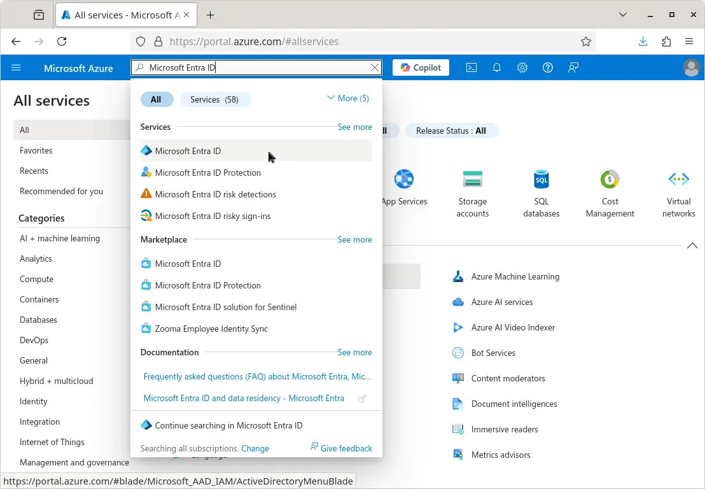

# Setting Up OpenShift Confidential Clusters on Azure

**Authors:** thuth@redhat.com \
**Jira Issue:** [COCL-45](https://issues.redhat.com/browse/COCL-45) \
**References:**
- [Azure Red Hat OpenShift](https://developers.redhat.com/products/openshift/openshift-public-cloud)
- [Red Hat OpenShift](https://developers.redhat.com/products/openshift/openshift-public-cloud)
- [Red Hat OpenShift Container Platform](https://developers.redhat.com/products/openshift/openshift-public-cloud)

## Prerequisites
Before we can start the installation, there are a few preparation steps. 
```bash
- Make sure you have your account for Microsoft Azure.
- You must have a Red Hat account. If you don’t have a Red Hat account, create one for free at www.redhat.com.
- We also assume that you are using a Linux environment (preferably Fedora or RHEL) on your local machine. Otherwise, please set up a virtual machine with Fedora or RHEL that you can use as a local host machine for the installation.
- You also need a public internet domain and the corresponding DNS zone set up for your Azure subscription. Please review the RHOCP documentation for details. 
- Alternatively, if you don’t want to or cannot provide a public domain, it is also possible to run the installation with this workaround providing pseudo-public entries for the created servers in the /etc/hosts file of your local machine. But this is very cumbersome and error-prone; thus not recommended here.
```

## Create SSH Key
To access the cluster nodes via SSH later, create an SSH key and add it to your ssh-agent:

```bash
ssh-keygen -t ed25519 -f ~/.ssh/openshift_key
ssh-add ~/.ssh/openshift_key
```
Make sure to remember your key passphrase if you specified one, otherwise you won’t be able to use your key again later.

## Install OpenShift Client and Installer
Download and install the OpenShift client and installer: 

Create a folder for storing the files related to the installation:
```bash
mkdir openshift
cd openshift
```

Next download the installer and client. Then copy the binaries to a folder in your $PATH, as follows:
```bash
curl -O \
  https://mirror.openshift.com/pub/openshift-v4/clients/ocp/4.17.15/openshift-install-linux.tar.gz
tar -xaf openshift-install-linux.tar.gz
mkdir ~/bin                              # If you don’t have a private “bin” directory yet
mv -v openshift-install ~/bin/

curl -O \
  https://mirror.openshift.com/pub/openshift-v4/clients/ocp/4.17.15/openshift-client-linux.tar.gz
tar -xaf openshift-client-linux.tar.gz
mv -v oc ~/bin/
```
You should now be able to run the commands in the shell. You can check with the `oc --help` command to see the help text of the `oc` command.


## Obtain an OpenShift pull secret
To run the installer, we also need to obtain an OpenShift pull secret by visiting [OpenShift downloads](https://cloud.redhat.com/openshift/downloads) and login with your Red Hat account. Then complete the following steps:

1. In the left menu, click on Cluster List.
2. Click the Create Cluster button.
3. Locate the Run it yourself section and select [Azure (x86_64)](https://console.redhat.com/openshift/install/azure).
4. Click on Automated to select the installer provisioned infrastructure.
5. Click the Download pull secret button and save the file under the name “pull-secret” in the OpenShift folder you created earlier. Make sure nobody else gets access to it.

In case you haven’t installed the openshift-installer and client in the previous step, you can also download the corresponding packages.

## Get a Service Principal with client secret on Azure
Now that we have everything we need from the Red Hat side, we can continue on Azure. Go to the [Azure portal](https://portal.azure.com/) and log in.

To allow the RHOCP installer to create virtual machines for us, we require a Service Principal with a client secret. If you don’t have a Service Principal for this yet, follow these steps to create one:

- In the upper search box, type in "Microsoft Entra ID" and click on the result in the Services section to get to the corresponding page (Figure 1).
        
- On the Overview screen, copy the Tenant ID and store it for later.
- In the left hand menu, click on App registrations in the Manage section.
- Now click on + New Registration, provide a name for the service principal and click Register
- From the overview page, copy the Application (client) ID of the service principal that you just created and store it for later.
- Next click on the Add certificate or secret link.
- Click on + New Client secret, add a short description and expiry date and click Add.
- Locate the secret under Value and save it in a file on your local machine. Please note that you cannot view this value again later, so this needs to be done immediately.

## Configure access permissions of your Service Principal
Switch to your home screen in Azure and select Subscriptions. You should have a subscription ready to use for the installation. Note the corresponding subscription ID from the list, since we will need it again later. Then complete the following steps:

- Click on the “Subscription Name” of your subscription and then select Access Control (IAM) in the left-hand column.
- Select + Add in the upper left and choose Add role assignment.
- Switch to the Privileged administrator roles tab and select Contributor. 
- Click the Next button at the bottom of the page.
- Click on + Select members and search for the name of the Service Principal that you want to use. 
- Choose the entry, then click on the Select button at the bottom of the page.
- Click the Next button to get to the Assignment type tab and double check the information.
- Click on the Next button again to get to the Review + assign tab. Double check the information here. If it looks sane, press the Review + assign button at the bottom left of the page to finalize the role assignment.

Once you finish the previous setting, do the same steps again. But this time, use these modified steps instead:

- When you come to the Privileged administrator roles tab, select User Access Administrator instead of Contributor this time. 
- Then click the Next button and select the Service Principal as a member again. 
- Go to the Conditions tab and select Allow User to assign all roles. 
- Finally finish the setup by reviewing and confirming the information in the Review + assign tab.

## Install Openshift
Now that we finished all the preparation work, we can start the installation itself.

## Create the install-config file
Run the following command to create a configuration file with the installer:

```bash
openshift-install create install-config --dir ./installer-dir
```
Answer the installer questions to set up the required information as follows:

- Enter file name of your SSH key (.../openshift_key.pub).
- Select Azure as platform.
- If this is the first time you are installing, be prepared to provide answers to these questions:
    - Your Azure subscription ID
    - The tenant ID
    - The service principal client ID (i.e. its application ID)
    - The client secret of the service principal
- Select a region close to you.
- Select your base domain.
- Provide a name for your cluster.
- Paste-in the pull secret that you downloaded from cloud.redhat.com.

This should create an "install-config.yaml" file in the installer-dir. To continue with installing RHOCP on confidential VMs, open the file. Replace the compute and controlPlane sections with the following settings:

```bash
compute:
- architecture: amd64
  hyperthreading: Enabled
  name: worker
  platform:
    azure:
      type: Standard_DC4ads_v5
      settings:
        securityType: ConfidentialVM
        confidentialVM:
          uefiSettings:
            secureBoot: Enabled
            virtualizedTrustedPlatformModule: Enabled
      osDisk:
        securityProfile:
          securityEncryptionType: VMGuestStateOnly
        diskSizeGB: 256
  replicas: 3
controlPlane:
  architecture: amd64
  hyperthreading: Enabled
  name: master
  platform:
    azure:
      type: Standard_DC8ads_v5
      settings:
        securityType: ConfidentialVM
        confidentialVM:
          uefiSettings:
            secureBoot: Enabled
            virtualizedTrustedPlatformModule: Enabled
      osDisk:
        securityProfile:
          securityEncryptionType: VMGuestStateOnly
        diskSizeGB: 256
  replicas: 3
```

You can find additional information in the [Enabling confidential VMs](https://docs.openshift.com/container-platform/4.17/installing/installing_azure/ipi/installing-azure-private.html#installation-azure-confidential-vms_installing-azure-private) section of the RHOCP installing instructions.

## Starting the installation
Now we should be all set to do the installation. Run the following command to start it:

```bash
openshift-install create cluster --dir ./installer-dir
```
Once the installation is finished, write down the password for the kubeadmin user printed at the end of the log.

## Testing the installation
Open the `console-openshift-console.apps…` link in your browser. You should see the RHOCP user interface there. Log in as “kubeadmin” with the password that you got at the end of the installation.

Now you can enjoy exploring your RHOCP installation. If you want to test deployment of a container, you can use `nginxinc/nginx-unprivileged` as a very simple test.

To test whether the nodes of the cluster run on SEV-enabled hardware, you can install the openshift-clients tool and execute the following in the shell of your local machine:
```bash
export KUBECONFIG=$PWD/installer-dir/auth/kubeconfig
for node in $(oc get nodes -o=custom-columns=NAME:.metadata.name --no-headers) ; do \
  echo "$node:" $(oc debug -q "node/$node" -- dmesg -t | grep SEV) ; \
done
```
This should print out the name of each node, followed by the string, “Memory Encryption Features active: AMD SEV.” Of course this is only an indication that the nodes are running on secure hardware, not a sufficient reason to fully trust this installation. For the latter, proper attestation is required, too. We will talk about this in a future article.

## Shutting down the cluster
If you don’t actively work with your RHOCP installation anymore, you should shut down the VMs to avoid costs for the VMs. Please refer to the [RHOCP documentation](https://docs.openshift.com/container-platform/4.17/backup_and_restore/graceful-cluster-shutdown.html) for the instructions on how to do this gracefully.

And if you don’t need your installation at all anymore, you can destroy the cluster completely by running the following command: `openshift-install destroy cluster --dir ./installer-dir`.

## Summary
In this article, you learned how a user can leverage the available AMD SEV-SNP support on Azure to deploy an OpenShift cluster on confidential nodes. This way, you can use strong memory encryption and isolation mechanisms to protect the confidentiality of nodes on the Azure infrastructure. For more information, refer to the article, [Confidential computing platform-specific details](https://www.redhat.com/en/blog/confidential-computing-platform-specific-details). 

For a full installation for production needs, please visit the [documentation for installing RHOCP on Azure](https://docs.redhat.com/en/documentation/openshift_container_platform/4.17/html/installing_on_azure/preparing-to-install-on-azure) instead. If you are just looking for a managed, non-confidential RHOCP installation, you may want to consider using [Azure Red Hat OpenShift” (ARO)](https://azure.microsoft.com/en-us/products/openshift/) instead.